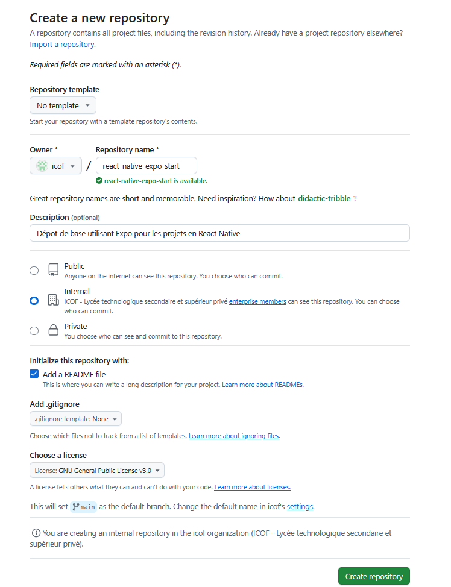
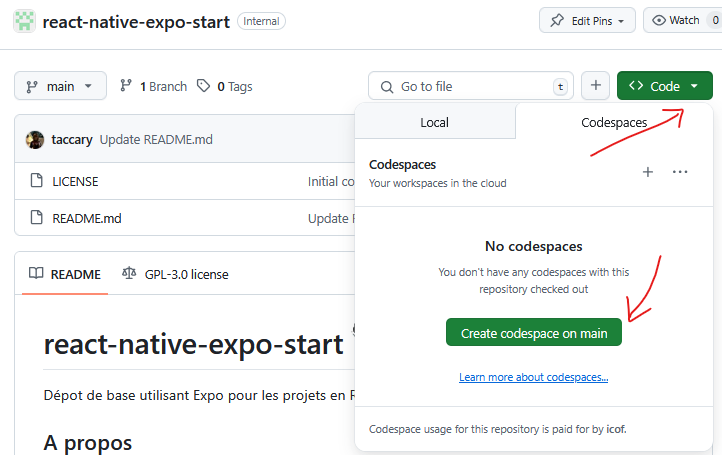
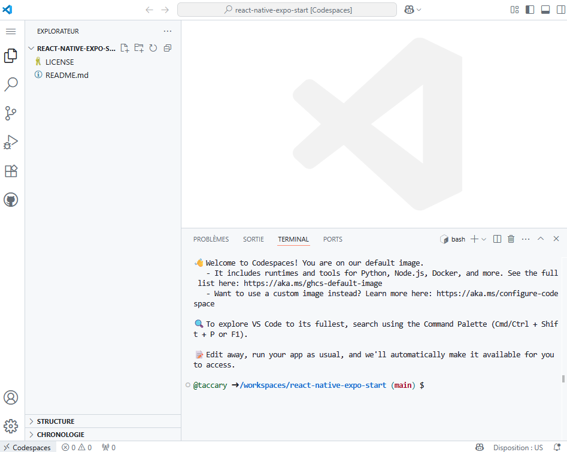
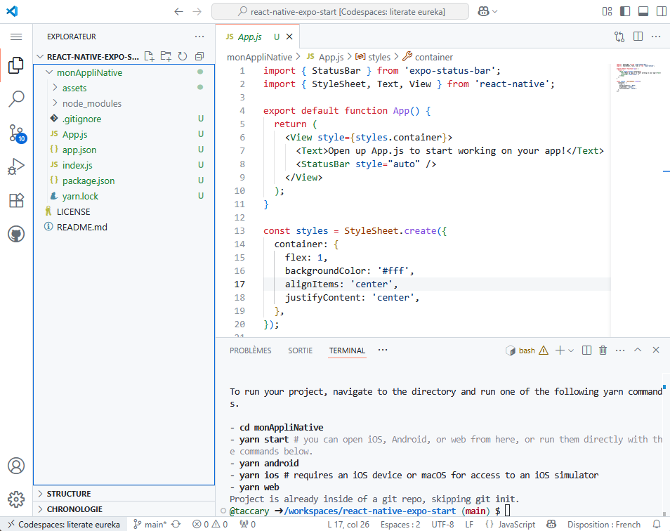
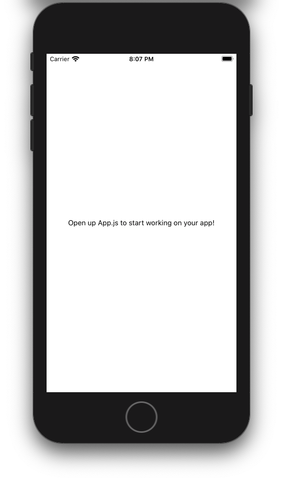

# Configurer un dépot GitHub pour développer un projet React Native avec Expo dans un Codespace 🐙🐱 📱

Cette activité est le point de départ qui explique comment utiliser les Codespaces GitHub pour développer des applications React Native en utilisant [Expo](https://expo.io) et les Codespaces.

Avec cette solution vous pourrez lancer un Codespace, initier un dépôt et 2 minutes plus tard, voir les changements en direct sur votre appareil mobile (iOS ou Android) sans avoir besoin d'une configuration supplémentaire.

## Prérequis

Vous aurez besoin de :
- Un compte [GitHub](www.github.com) 
- Un compte [Expo.io](www.expo.io)
- Accès à [GitHub Codespaces](https://github.com/features/codespaces/)
- [Expo installée sur votre appareil mobile](https://expo.io/tools)

## 1. Créer un dépot GitHub vide

Allez sur GitHub.com et créez un nouveau dépôt. Si vous êtes nouveau sur GitHub, trouvez l'icône `+` en haut à droite et cliquez sur `New Repository`. Choisissez n'importe quel nom, et `Initialisez ce dépôt avec un README`.



## 2. Lancer un espace de code pour ce dépôt

Cliquez sur « Code » et « Ouvrir avec les espaces de code ».


Cela lancera le conteneur de développement et vous devriez voir votre projet dans VS Code. Quand tout sera terminé, vous devriez avoir un dépot très vide avec juste le fichier `README.md`


## 3. Installer Expo sur votre environnement Codespaces

Expo est un framework et une plateforme pour les applications React universelles qui vous aident à développer, construire, déployer et itérer rapidement sur iOS et Android". On va installer la dernière version du client expo dans le codespace.

Dans le terminal, saisissez :

```
npm install -g @expo/cli@latest
```
## 4. Créer un projet expo vide

Avec le client expo installé, créez un projet Expo vide en lançant la commande suivante :

````
npx create-expo-app monAppliNative --template blank
````

Allez dans le dossier de votre application `monAppliNative` :
````
cd monAppliNative
````

Ce dossier contient un projet Expo complet avec juste un peu d'interface utilisateur sur `App.js`. N'hésitez pas à y jeter un coup d'oeil.


## 5. Connexion à Expo

Avant de lancer l'application, nous devons nous connecter à notre compte expo pour pouvoir nous y connecter à distance. Lancez la commande suivante et entrez votre nom d'utilisateur et votre mot de passe expo :

```
npx expo login
```

## 6. Démarrer l'application et la faire évoluer

Ok, maintenant nous voulons démarrer notre application et la tester sur notre propre appareil mobile. Allons dans le dossier de notre projet et démarrons l'application :

```
npx expo start --tunnel
```

Lorsqu'on vous demande pour installer le paquet @expo/ngrok@^4.1.0, acceptez-le.
Si tout a fonctionné comme prévu, vous devriez voir un code QR. Scannez le code QR ci-dessus avec l'application Expo (Android) ou l'application Camera (iOS). Sur iOS, vous serez invité à ouvrir Expo sur votre téléphone, que vous devriez déjà avoir installé et auquel vous devriez être connecté. 

Le premier chargement de l'application peut prendre un peu de temps et vous devrez peut-être cliquer sur "Reload JS" si vous obtenez une erreur. En fait, avec cette méthode, l'espace de code et votre téléphone se déconnectent assez rapidement, donc si vous voyez un `Disconnected from the Metro server`, secouez votre téléphone pour obtenir le menu Expo et cliquez sur `Reload`. Lorsque tout fonctionne, vous devriez voir cet écran :



Allez dans votre espace de code et modifiez le fichier App.js pour changer la propriété backgroundColor et le texte puis sauvegardez le fichier. Si le téléphone est toujours connecté, vous devriez voir vos modifications automatiquement.

### Structure de l'application de base créée
```
appli-V2
├── .expo
├── assets/
│   ├── adaptive-icon.png
│   ├── favicon.png
│   ├── icon.png
│   └── splash-icon.png
├── node_modules
├── App.js
├── app.json
├── index.js
├── package-lock.json.js
├── package.json
└── yarn.lock
```

**Explication de la structure**
- *.expo/ : Dossier généré par Expo qui contient des fichiers de configuration et des données spécifiques à Expo pour le développement de l'application.*
- assets/ : Contient les fichiers d'images et autres ressources statiques.
- *node_modules/ : Dossier généré qui contient toutes les dépendances et modules installés via npm. Ce dossier est généré automatiquement lors de l'installation des dépendances définies dans le fichier `package.json`.*
- App.js : Point d'entrée principal de l'application.
- app.json : Fichier de configuration pour Expo. Il contient des informations sur l'application telles que le nom, l'icône, les permissions, et d'autres paramètres spécifiques à Expo.
- index.js : Fichier de démarrage qui enregistre l'application et la rend dans le DOM.
- package-lock.json : Ce fichier est généré automatiquement par npm pour verrouiller les versions exactes des dépendances installées dans votre projet. Il garantit que les mêmes versions des paquets seront installées à chaque fois que quelqu'un exécute `npm install`, ce qui assure la cohérence des environnements de développement et de production. Vous ne devez pas modifier ce fichier manuellement.
- package.json : Fichier de configuration principal pour npm. Il contient des informations sur le projet, telles que le nom, la version, les scripts de build, les dépendances et les métadonnées du projet. Ce fichier est édité manuellement par les développeurs pour ajouter ou mettre à jour les dépendances et les scripts.
- yarn.lock : Ce fichier est généré automatiquement par Yarn pour verrouiller les versions exactes des dépendances installées dans votre projet. Il garantit que les mêmes versions des paquets seront installées à chaque fois que quelqu'un exécute `yarn install`, ce qui assure la cohérence des environnements de développement et de production. Vous ne devez pas modifier ce fichier manuellement.

les dossiers .expo et node_modules ne sont pas remontés dans le dépot (gitignore) et sont a construire dans chaque codespace (avec les commandes des étapes ci-dessus)

## 7. Variante sans téléphone (en utilisant l'émulateur du navigateur)

Il est également possible d'exécuter votre projet React Native Expo en mode web (utile lorsqu'on a pas de téléphone sous la main), pour cela, vous devez installer les dépendances web dans le projet avant de lancer le serveur de développement. 

```
npx expo install react-dom react-native-web @expo/metro-runtime
```

Pour démarrer l'application dans un navigateur ensuite,  vous avez deux possibilités :
1. lancer la commande npx ```npx expo start --web```
2. lancer la commande npx ```npx expo start``` puis taper w pour executer le mode web

Dans les 2 cas, votre application est maintenant consultable sur le port 8081 depuis votre navigateur.

## 8. Variante sans téléphone (en utilisant l'émulateur Android Studio) - partie à tester

### a. Installation d'Android Studio

```bash
# Télécharger Android Studio depuis le site officiel
# https://developer.android.com/studio
```

### b. Configuration d'Android Studio

1. **Installer Android Studio** et accepter les licences
2. **Ouvrir Android Studio** → `Configure` → `SDK Manager`
3. **Onglet SDK Platforms** : Installer au moins une version d'Android (ex: Android 13)
4. **Onglet SDK Tools** : Vérifier que ces éléments sont installés :
   - Android SDK Build-Tools
   - Android Emulator
   - Android SDK Platform-Tools

### c. Créer un AVD (Android Virtual Device)

```bash
# Dans Android Studio :
# Tools → AVD Manager → Create Virtual Device
# Choisir un appareil (ex: Pixel 6)
# Choisir une image système (ex: Android 13)
# Finaliser la création
```

### d. Variables d'environnement (Linux/Codespace)

```bash
# Ajouter au fichier ~/.bashrc ou ~/.zshrc
export ANDROID_HOME=$HOME/Android/Sdk
export PATH=$PATH:$ANDROID_HOME/emulator
export PATH=$PATH:$ANDROID_HOME/tools
export PATH=$PATH:$ANDROID_HOME/tools/bin
export PATH=$PATH:$ANDROID_HOME/platform-tools

# Recharger le shell
source ~/.bashrc
```

### e. Lancer l'émulateur

```bash
# Lister les AVD disponibles
emulator -list-avds

# Lancer un émulateur spécifique
emulator -avd Pixel_6_API_33

# Ou depuis Android Studio : AVD Manager → Play button
```

### f. Démarrer votre projet Expo

```bash
cd monAppliNative
npx expo start
```

### g. Connecter à l'émulateur

Une fois l'émulateur lancé et votre projet démarré :
- **Appuyez sur `a`** dans le terminal Expo
- L'application s'installera automatiquement sur l'émulateur
- Ou scannez le QR code avec l'app Expo Go installée sur l'émulateur

### Problèmes courant :

```bash
# Si l'émulateur n'est pas détecté
adb devices

# Redémarrer le serveur ADB si nécessaire
adb kill-server
adb start-server
```

L'émulateur Android vous permettra de tester votre app comme sur un vrai téléphone avec toutes les fonctionnalités natives.


## Lancer le projet pour la suite

La commande ```npx expo start``` servira à chaque fois que vous voudrez redémarrer le serveur de développement (au lancement du Codespace par exemple)

Vous pouvez commencer à modifier le code selon vos besoins. Par exemple, vous pouvez éditer les fichiers dans le dossier src/ pour apporter des changements à l'application.

Pour recharger l'application après avoir apporté des modifications, enregistrez simplement vos fichiers et l'application se rechargera automatiquement grâce à la fonctionnalité de rechargement en direct d'Expo. Si vous avez beson de forcer le rechargement, suivez les consignes dans le terminal (r pour recharger l'app).

Si vous loggez des étapes dans le code (console.log()), vous verrez ces logs de débug dans le terminal.
