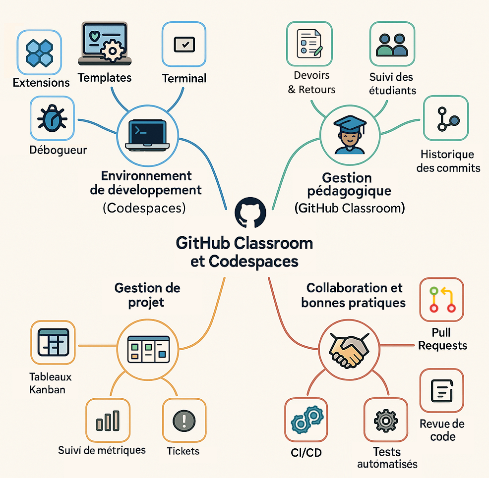
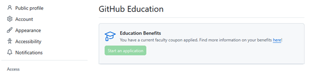

# Intro à GitHub Codespace et Classroom

## Table des matières 
- [Qu'est-ce que GitHub Education ?](#quest-ce-que-github-education)
  - [GitHub Codespaces](#github-codespaces)
    - [Services de base](#services-de-base)
    - [Avantages pédagogiques](#avantages-pédagogiques)
    - [Concepts pratiqués](#concepts-pratiqués)
  - [GitHub Classroom](#github-classroom)
- [A vous de jouer](#a-vous-de-jouer)
  - [Postuler à GitHub Education](#postuler-à-github-education)
  - [Exemple d'usage GitHub Codespaces & GitHub Classroom](#exemple-dusage-github-codespaces-github-classroom)

# Qu'est-ce que GitHub Education ?

**GitHub Education** est une initiative de GitHub qui met gratuitement à
disposition des enseignants, étudiants et établissements scolaires des
outils professionnels pour l'apprentissage du développement logiciel.

Elle permet d'accéder à :

-   **GitHub Classroom** : créer, distribuer et corriger des devoirs de
    programmation.

-   **GitHub Codespaces** : environnement de développement complet dans
    le cloud.

-   **GitHub Student Developer Pack** : des outils et services gratuits
    pour les étudiants.

-   **GitHub Global Campus** : plateforme centralisée pour les
    ressources pédagogiques, la communauté et les formations.

**Objectif** : rendre l'enseignement de l'informatique plus accessible,
plus moderne et plus proche des pratiques professionnelles.

## GitHub Codespaces

GitHub **Codespaces** est un environnement de développement complet dans
le cloud, intégré à GitHub. Il permet d'écrire, exécuter et tester du
code directement depuis un navigateur web, sans avoir besoin d'installer
quoi que ce soit sur son ordinateur. Il suffit de quelques secondes pour
lancer un environnement prêt à l'emploi.

### Services de base

Plusieurs **services de base** sont automatiquement disponibles pour
offrir un environnement de développement complet prêt à l'emploi :

-   Éditeur de code intégré (VS Code Web) :

    -   Interface complète de Visual Studio Code dans le navigateur.

    -   Prise en charge des extensions, de l'autocomplétion, du linting,
        etc.

    -   Navigation dans les fichiers, recherche, terminal
        intégré.

-   Terminal Linux intégré permettant d'exécuter des scripts, des
    commandes Git, des installations, etc.

-   Conteneur de développement (Dev Container). Basé sur Docker, il
    définit l'environnement logiciel (langages, outils, dépendances). Le
    fichier devcontainer.json permet de personnaliser :

    -   L'image Docker utilisée.

    -   Les extensions VS Code à installer.

    -   Les scripts à exécuter à l'ouverture.

-   **Git** pré-installé

-   Possibilité d'exposer des ports (par exemple pour un serveur web
    local). GitHub fournit des **URLs sécurisées** pour tester des
    applications web dans le navigateur.

-   Prise en charge des gestionnaires de paquets (npm, pip, apt, etc.)
    avec possibilité d'installer automatiquement les dépendances à
    l'ouverture du Codespace.

-   Intégration possible avec **GitHub Copilot** pour l'autocomplétion
    intelligente du code (si activé).

### Avantages pédagogiques :

-   **Pas de configuration locale** : Les étudiants n'ont rien à
    installer, ce qui évite les problèmes de compatibilité.

-   **Uniformité** : Tout le monde travaille dans le même environnement,
    ce qui facilite le support et la correction.

-   **Intégration avec GitHub Classroom** : Les devoirs peuvent être
    lancés directement dans Codespaces.

-   **Forme des étudiants à des pratiques professionnelles modernes** :
    ce type d'environnement est proche de celui qu'ils retrouveront en
    entreprise.

### Concepts pratiqués

L'utilisation des Codespaces permet d'aborder par la pratique des
concepts par forcément évidents :

-   **Conteneurisation** (Docker) : *permet d'introduire la
    conteneurisation sans avoir à installer Docker localement.*

    -   Chaque Codespace repose sur un conteneur Docker configuré via un
        fichier devcontainer.json qui peut être personnalisé (langages,
        outils, dépendances).

    -   Les étudiants découvrent comment un environnement de
        développement peut être défini comme du code, (compétence clé
        dans le DevOps).

-   **Scripting et automatisation :** *permet d'initier à
    l'automatisation et à la logique de scripting dans un contexte
    réel.*

    -   Les projets peuvent inclure des scripts shell, Python, ou
        Node.js pour automatiser des tâches (tests, déploiement,
        traitement de données).

    -   Les étudiants peuvent écrire et exécuter des scripts dans le
        terminal intégré.

-   **Utilisation de ressources cloud :** *Les étudiants comprennent que
    le développement ne se fait plus uniquement en local, mais dans des
    environnements distribués :*

    -   Introduction aux notions de **développement cloud-native**.

    -   Visualisation des métriques de consommation pour comprendre
        l'impact d'un service qui tourne.

-   **Utilisation de Git et GitHub généralisée :** *permet dès les
    premiers TP de première année d'utiliser Git pour la gestion des
    versions et la collaboration.*

    -   Les étudiants apprennent rapidement à cloner un dépôt, faire des
        commits, gérer les conflits, travailler avec des pull requests

    -   On peut également utiliser rapidement les outils de suivi de
        projets (backlog, kanban au sein des TP et projets)

<u>Ressource</u> :
<https://docs.github.com/fr/codespaces/about-codespaces/what-are-codespaces>

## GitHub Classroom

GitHub Classroom est une plateforme pour aider les enseignants à créer
et gérer des salles de classe virtuelles. Elle permet de créer des
dépôts devoirs, de les distribuer aux étudiants, de suivre les
soumissions et de fournir des retours.

**Fonctionnalités** :

-   **Création de devoirs et distribution automatisée** : Les
    enseignants peuvent créer des devoirs pour des étudiants individuels
    ou des groupes.

-   **Suivi en temps réel des devoirs** : Les enseignants peuvent suivre
    les soumissions et les progrès des étudiants via un tableau de bord.
    Ils ont accès au code produit et peuvent exécuter les applications
    dans une conteneur identique à celui de l'étudiant.

-   **Auto-évaluation** : Les devoirs peuvent être configurés pour être
    évalués automatiquement à l\'aide de tests prédéfinis.

-   **Intégration avec les systèmes de gestion de l\'apprentissage
    (LMS)** : Il est possible de connecter GitHub Classroom à un LMS
    pour importer des listes d\'étudiants 

-   **Travail en groupe facilité** avec la possibilité de créer des
    dépôts de groupe partagés automatiquement entre une équipe
    d'étudiants et les enseignants.

<u>Ressource</u> : [About GitHub Classroom - GitHub
Docs](https://docs.github.com/en/education/manage-coursework-with-github-classroom/get-started-with-github-classroom/about-github-classroom)

# A vous de jouer

## Postuler à GitHub Education

Pour pouvoir accéder gratuitement à ces fonctionnalités, il faut faire
sur GitHub une demande d'accès à GitHub Education.[]{.mark}

**Pré-requis :**

-   [Disposer d'un compte GitHub :
    <https://docs.github.com/fr/get-started/start-your-journey/creating-an-account-on-github>]{.mark}

-   [Disposer d'un document officiel, comme une attestation signée de
    votre chef d'établissement par exemple, qui prouve votre affiliation
    à l'établissement scolaire.]{.mark}

Etapes :

1.  Connectez-vous à votre compte GitHub

    -   Il faut avoir un compte GitHub avec authentification double
        facteur

    -   Il est utile au préalable de **rattacher une adresse éducation**
        (adresse académique ou établissement scolaire) à votre compte
        Github si ce n'est pas déjà le cas :
        <https://github.com/settings/emails> .

    -   Autre possibilité : créez un second compte Github avec cette
        adresse si vous préférez.

2.  Suivez les étapes du tuto : [Rejoindre GitHub Education en tant
    qu'enseignant - Documentation
    GitHub](https://docs.github.com/fr/education/about-github-education/github-education-for-teachers/apply-to-github-education-as-a-teacher)
    pour faire la demande de rattachement à GitHub Education.

    -   Utilisez bien votre mail « éducation »

    -   Fournissez une preuve d'affiliation que vous êtes enseignant,
        membre du corps professoral ou chercheur (courrier du chef
        d'établissement, pv d'installation)

3.  Patientez...

    -   Il faut parfois patienter une 10aine de jours avant de recevoir
        le « coupon » de réduction qui vous ouvre en fait les droits aux
        Codespaces et aux autres avantages GitHub Education.

Une fois votre candidature approuvée, vous recevrez un mail et aurez
accès aux ressources et avantages de GitHub Education, y compris GitHub
Classroom et GitHub Codespaces.

A partir de ce moment, <https://education.github.com> vous permettra de
découvrir les offres liées à votre nouveau statut. (<u>Note</u> :
tous les 2 ans, il faudra revalider votre statut pour conserver les
avantages)

## Exemple d'usage GitHub Codespaces & GitHub Classroom

1.  En tant qu'enseignant, on crée dans son espace perso ou celui de son
    organisation un dépôt « template » avec la config du codespace de
    départ et éventuellement du code.

2.  Sur GitHub Classroom, dans une promotion, on utilise ce template
    dans un devoir.

3.  On transmet ensuite aux étudiants le lien d'invitation au devoir.
    (Il est possible d'enrôler une classe avec une liste ou de créer les
    profils après acceptation d'un devoir, je n'expliquerais pas ça
    ici).

4.  Les étudiants ouvrent le lien du devoir pour accepter celui-ci. La
    plateforme leur crée à chacun un dépôt personnel partagé avec
    l'enseignant. Les étudiants peuvent ouvrir ce dépôt dans un
    Codespace qui s'ouvre alors avec :

    -   Le code du projet dans un vscode dans un conteneur (accessible)
        en gui web ou appli bureau) avec un terminal pour exécuter les
        scripts, des outils de debug,

    -   Les outils nécessaires (Python, Node.js, etc.) déjà installés
        dans cet environnement (config prévue par l'enseignant dans un
        Dockerfile )

    -   Les extensions vscode prévues par l'enseignant (définies dans un
        devcontainer.json)

<u>Ressource</u> : [Utiliser GitHub Codespaces avec GitHub
Classroom - Documentation
GitHub](https://docs.github.com/fr/education/manage-coursework-with-github-classroom/integrate-github-classroom-with-an-ide/using-github-codespaces-with-github-classroom)

---

**[← Retour au sommaire](README.md)** | **[Webinaire →](webinaire.md)**
{: .text-center}